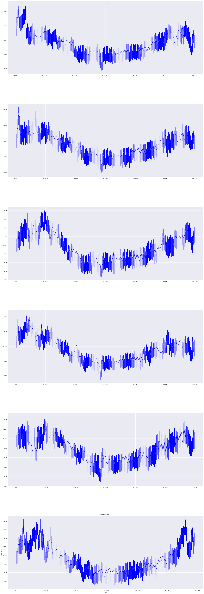
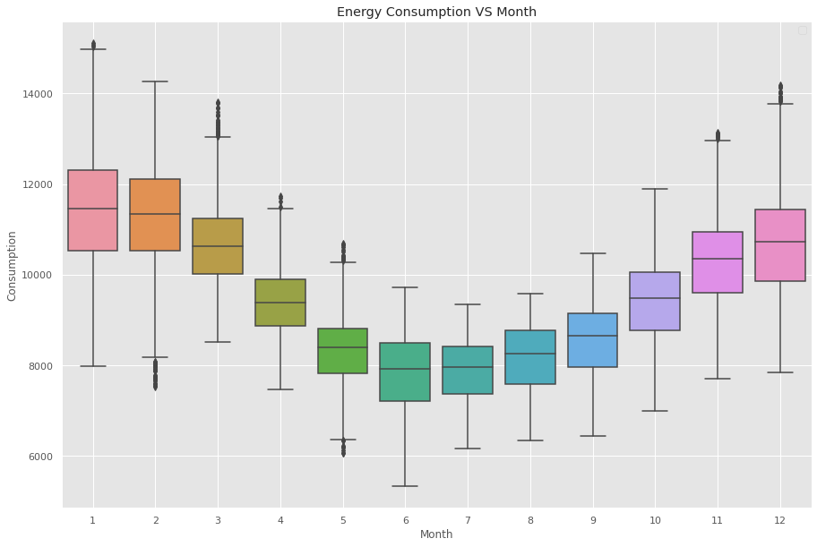
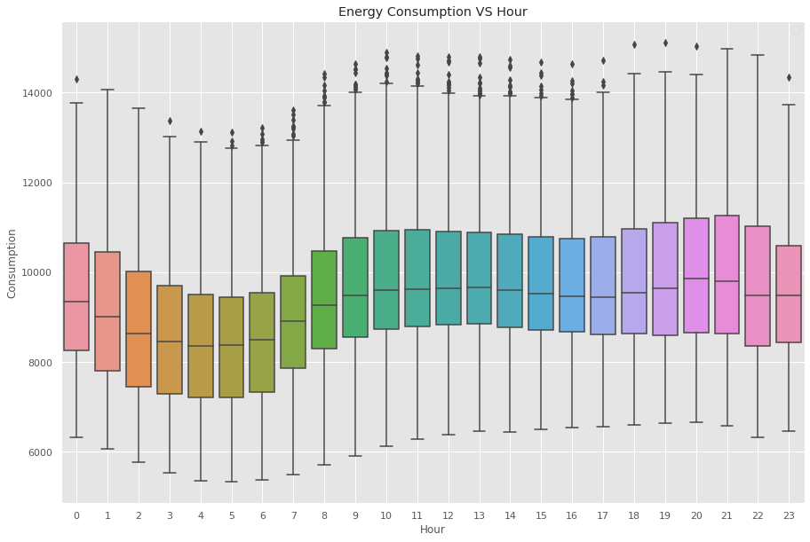

# ⚡ Energy Consumption Forecasting and Visualization

## 📌 Project Overview
Energy consumption is increasing rapidly, and predicting future demand is essential for efficient energy management.  
This project focuses on analyzing historical electricity consumption data and forecasting future usage using **Machine Learning and Deep Learning techniques**.

The system compares two models:
- Random Forest (Machine Learning)
- LSTM (Deep Learning)

Among these, **LSTM performs better** as it captures time-based patterns effectively.

---

## 🎯 Problem Statement
Electricity consumption varies based on time, season, and user behavior.  
Traditional methods fail to accurately predict future demand due to:
- Inability to capture complex patterns  
- Lack of time dependency handling  

This project aims to build a system that can **accurately forecast electricity consumption**.

---

## 💡 Proposed Solution
The proposed system:
1. Collects historical electricity data  
2. Performs data preprocessing  
3. Applies feature engineering  
4. Trains Random Forest and LSTM models  
5. Compares performance using evaluation metrics  
6. Generates predictions and visualizations  

---

## 🛠️ Technologies Used
- Python  
- Pandas  
- NumPy  
- Matplotlib  
- Seaborn  
- Scikit-learn  
- TensorFlow / Keras  
- Power BI  

---

## 📊 Dataset
- Source: Finland Electricity Consumption Dataset  
- Total Records: ~52,965 rows  
- Key Columns:
  - Timestamp  
  - Electricity Consumption  

---

## 🔄 Project Workflow
1. Data Collection  
2. Data Preprocessing  
3. Feature Engineering (Day, Month, Lag Features)  
4. Data Splitting (Train/Test)  
5. Model Training  
6. Prediction  
7. Evaluation  
8. Visualization  

---

## 🤖 Models Used

### 🌳 Random Forest
- Handles nonlinear relationships  
- Works on tabular data  
- Faster training  

### 🧠 LSTM (Long Short-Term Memory)
- Designed for time-series data  
- Captures temporal dependencies  
- Provides higher accuracy  

---

## 📏 Evaluation Metrics

### Mean Squared Error (MSE)
MSE = (1/n) * Σ(actual - predicted)²  

### Root Mean Squared Error (RMSE)
RMSE = √MSE  

### R² Score
R² = 1 - (SS_res / SS_tot)  

---

## 📈 Results

| Model | RMSE | R² Score |
|------|------|---------|
| Random Forest | Higher | ~0.91 |
| LSTM | Lower (~0.08) | Higher (~0.95) |

👉 **Conclusion:** LSTM performs better than Random Forest.

---

## 📊 Visualization Results

### 🔹 Electricity Consumption Over Time

### 🔹 Year-wise Electricity Consumption

### 🔹 Actual vs Predicted Values

### 🔹 Energy Consumption vs Month

### 🔹 Energy Consumption vs Hour

---

## 🔮 Future Scope
- Real-time data integration  
- Weather-based prediction  
- Advanced hybrid models  
- Deployment as web application  

---

## 🏁 Conclusion
This project demonstrates that **LSTM is more effective** for electricity consumption forecasting due to its ability to learn time-based patterns.  
The system helps improve energy planning and supports smart grid systems.

---

## 🙏 Acknowledgment
We would like to thank our guide and team members for their support and guidance throughout the project.

---
